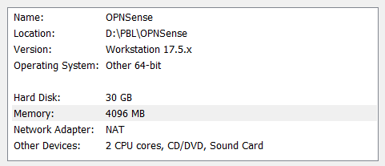

# OPNSENSE Installation

- Muhammad Ath Thoriq Kurnia Ramadhan
- 4332301013

## Objectives

- Install OPNSense
- Configure

## What is OPNSense?

OPNsense is an open source, FreeBSD-based firewall and routing software developed by Deciso, a company in the Netherlands that makes hardware and sells support packages for OPNsense.
[Wikipedia](https://en.wikipedia.org/wiki/OPNsense)

## Installation Steps

### Prerequisite

1. OPNSense ISO - [OPNSense Download Link](https://opnsense.org/download/)
2. Virtualization Software (e.g VMWare, VirtualBox)

### Installation

1. Create a new Virtual Machine in your Virtualization Software, in this case, I use VMWare Workstation.
   

   Here's my system details

   

2. After we created the Virtual Machine, we need to connect the OPNSense ISO to the machine.
   
3. Finally we can start the machine !
