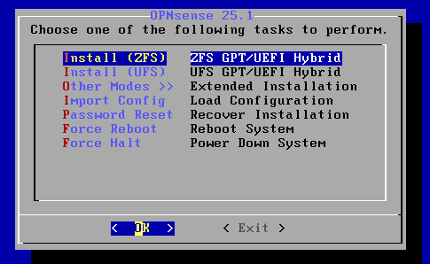

# OPNSENSE Installation

- Muhammad Ath Thoriq Kurnia Ramadhan
- 4332301013

## Objectives

- Install OPNSense

## What is OPNSense?

OPNsense is an open source, FreeBSD-based firewall and routing software developed by Deciso, a company in the Netherlands that makes hardware and sells support packages for OPNsense.
[Wikipedia](https://en.wikipedia.org/wiki/OPNsense)

## Installation Steps

### Prerequisite

1. OPNSense ISO - [OPNSense Download Link](https://opnsense.org/download/)
2. Virtualization Software (e.g VMWare, VirtualBox)

### Installation

1. Create a new Virtual Machine in your Virtualization Software, in this case, I use VMWare Workstation.
   

   Here's my system details

   

2. After we created the Virtual Machine, we need to connect the OPNSense ISO to the machine.
   
3. Finally we can start the machine !
4. Choose the interface that will be useed as WAN and LAN
5. Then, login as `installer` with password `opnsense`
6. Select keymap, for this case, i use the default keymap
7. Then choose the ZFS install [Why ZFS](https://www.reddit.com/r/PFSENSE/comments/gyq5x3/should_i_use_zfs_or_ufs_for_my_file_system/)

   

8. Then for the Device Type, in this case i use stripe

   

9. Then choose the disk

   

10. Lastly, format the disk

    

11. Then wait until the cloning process is completed.
12. After that, i do change the password for the root user

    

13. Then complete the install

    

14. Reboot Now

    

15. Now, we can access the web UI

    

> [!NOTE]
> if you have feedback for this report you can contact me via discord (athkr) or whatsapp
